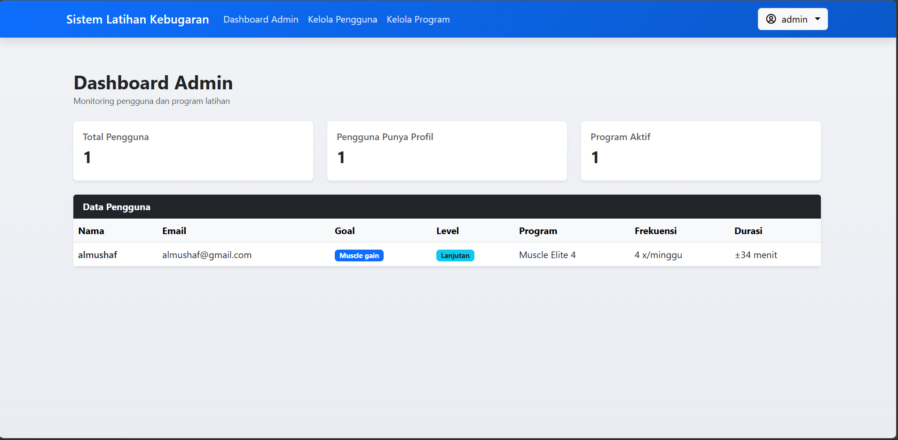
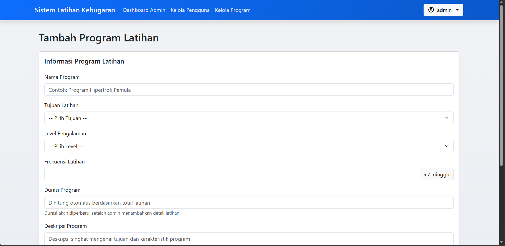
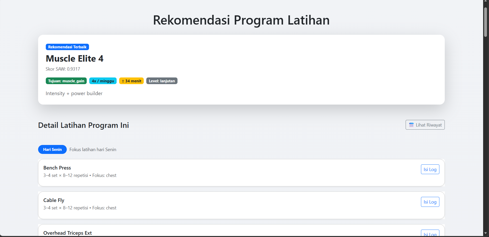
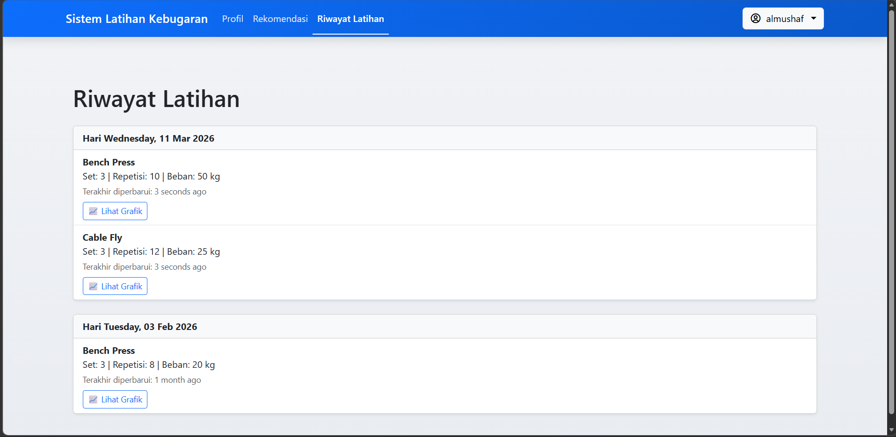

# 🏋️ Laravel Fitness Training Recommendation System

A web-based fitness training recommendation system built with Laravel, implementing the Simple Additive Weighting (SAW) method to assist users in selecting training programs based on their fitness goals.

🔗 **Live Demo**: https://rekomendasi-latihan.wuaze.com/

---

## 📌 Project Purpose

This project was developed as a portfolio project to demonstrate:
- Backend web development using Laravel
- Decision Support System implementation (SAW method)
- Fitness program recommendation logic
- Authentication, role-based access, and CRUD operations

---

## 🚀 Features

- User authentication (login & registration)
- Fitness goal selection
- Training program recommendation using SAW
- Admin dashboard for managing programs & criteria
- Responsive and clean user interface

---

## 🛠️ Tech Stack

- Language: PHP
- Backend Framework: Laravel 10
- Database: MySQL
- Frontend: Blade, Bootstrap
- Algorithm: Simple Additive Weighting (SAW)
- Tools: Git, GitHub

---
## Screenshots




## 👤 Demo Accounts

**Admin**
- Username: 
- Password: 

**User**
- Username: testuser
- Password: password
- atau bisa daftar dulu
---

## ⚙️ Installation (Local Setup)

```bash
git clone https://github.com/almushaf/laravel-fitness-recommendation.git
cd laravel-fitness-recommendation
composer install
cp .env.example .env
php artisan key:generate
php artisan migrate --seed

## 👤 Author

Al Mushaf  
Laravel-focused Web Developer with experience in building full-stack web applications, covering backend logic, database design, and frontend implementation using Blade templates.  
Skilled in authentication systems, CRUD dashboards, and data-driven features such as decision support systems using the Simple Additive Weighting (SAW) method.

GitHub: https://github.com/almushaf  
